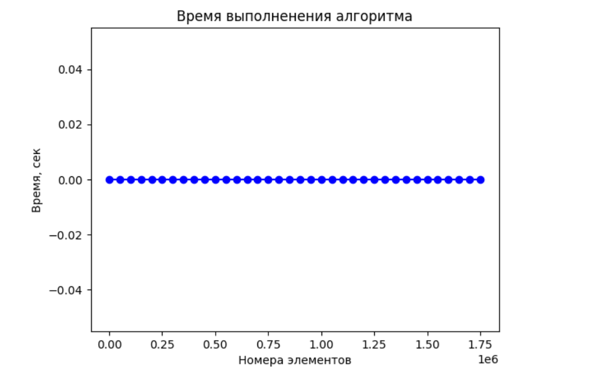
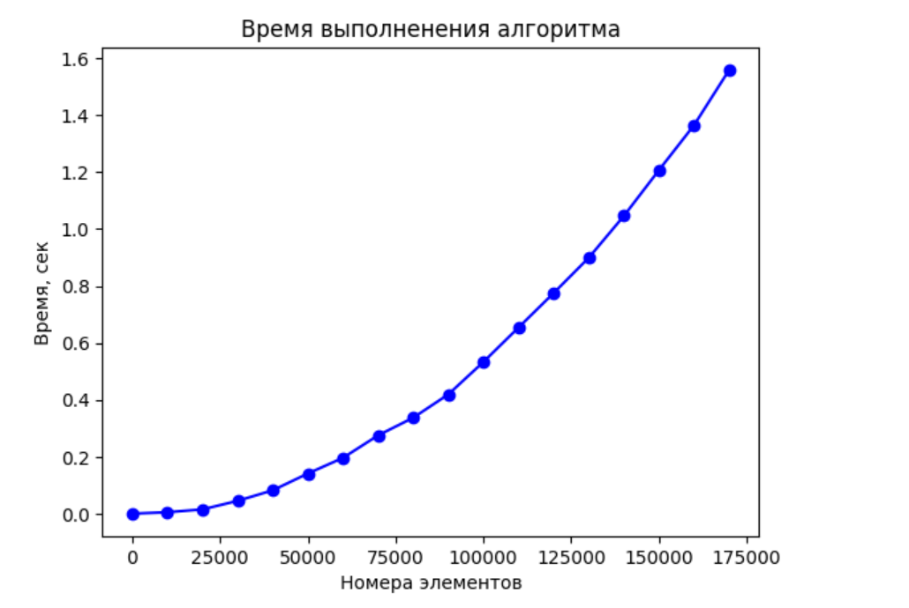
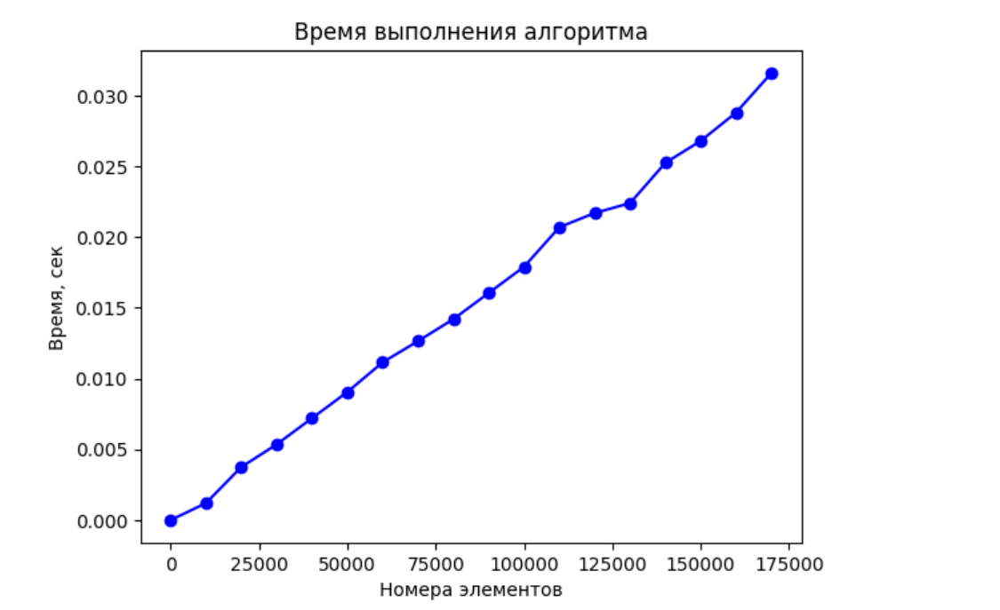
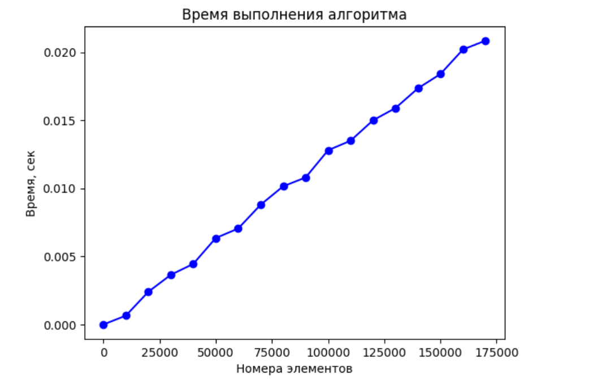
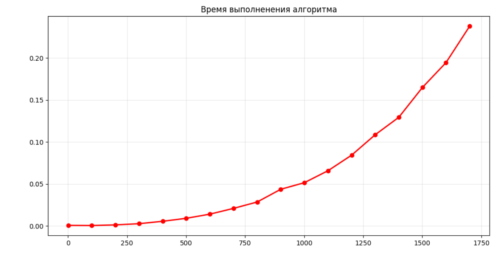

---
jupyter:
  jupytext:
    text_representation:
      extension: .md
      format_name: markdown
      format_version: '1.3'
      jupytext_version: 1.17.3
  kernelspec:
    display_name: Python 3 (ipykernel)
    language: python
    name: python3
---

```python
"""Эмпирический анализ временной сложности алгоритмов"""
```

```python
"""Асонов С.В ИУ10-36"""
```

```python
"""Задания"""
```

```python
"""Задание 1.1"""
```

```python
import random, usage_time
import matplotlib.pyplot as plt


def get_by_index(v: list):
    return v[random.randint(0, len(v) -1)]

items = range(1, 10**5 * (20 - 2), 50000)
func = usage_time.get_usage_time()(get_by_index)
times = [
    func([
        random.randint(1, 3) 
        for _ in range(n)
    ]) 
    for n in items
]

fig = plt.plot(items, times, 'bo-')
ax = plt.gca()

plt.title('Время выполнения алгоритма')
ax.set_xlabel('Номера элементов')
ax.set_ylabel('Время, сек')
```




```python
"""Задание 1.3"""
```

```python
import random, usage_time
import matplotlib.pyplot as plt


def multiplication_nums(v: list):
    multi = 1
    for num in v:
        multi *= num
    return multi


items = range(1, 10**4 * (20 - 2), 10000)
func = usage_time.get_usage_time()(multiplication_nums)
times = [
    func([
        random.randint(1, 3) 
        for _ in range(n)
    ]) 
    for n in items
]

fig = plt.plot(items, times, 'bo-')
ax = plt.gca()

plt.title('Время выполнения алгоритма')
ax.set_xlabel('Номера элементов')
ax.set_ylabel('Время, сек')
```



```python
"""Задание 1.4"""
```

```python
import random, usage_time
import matplotlib.pyplot as plt


def horner_method(v, x):
    result = v[0]
    for i in range(1, len(v)):
        result = result * x + v[i]
    return result

items = range(1, 10**4 * (20 - 2), 10000)
x_val = 1.5 

func = usage_time.get_usage_time()(horner_method)
times = [
    sum([
        func([
            random.randint(1, 10) 
            for _ in range(n)
        ], x_val)  
        for _ in range(20)
    ]) / 20
    for n in items
]


fig = plt.plot(items, times, 'bo-')
ax = plt.gca()

plt.title('Время выполнения алгоритма')
ax.set_xlabel('Номера элементов')
ax.set_ylabel('Время, сек')
```




```python
"""Задание 1.7"""
```

```python
import random, usage_time
import matplotlib.pyplot as plt


def mean(v):
    total = 0.0
    for element in v:
        total += element
    return total / len(v)


items = range(1, 10**4 * (20 - 2), 10000)
func = usage_time.get_usage_time()(mean)
times = [
    sum([
        func([
            random.randint(1, 10) 
            for _ in range(n)
        ])
        for _ in range(20)
    ]) / 20
    for n in items
]

fig = plt.plot(items, times, 'bo-')
ax = plt.gca()

plt.title('Время выполнения алгоритма')
ax.set_xlabel('Номера элементов')
ax.set_ylabel('Время, сек')
```



```python
"""Задание 2"""
```

```python
import numpy as np
import time
import matplotlib.pyplot as plt
from statistics import mean


N = 18  
max_n = 10**2 * N  
step = 100  
num_runs = 5  


n_values = []
times = []


for n in range(1, max_n + 1, step):
    
   
    A = np.random.rand(n, n)
    B = np.random.rand(n, n)
    print(f"Обрабатывается размер матрицы = {n}x{n}")
    run_times = []
    
  
    for run in range(num_runs):
        start_time = time.time()
        
        C = np.dot(A, B)
        
        end_time = time.time()
        run_times.append(end_time - start_time)
    
    n_values.append(n)
    times.append(mean(run_times))


plt.figure(figsize=(12, 6))
plt.plot(n_values, times, 'ro-', linewidth=2, markersize=6)
plt.title('Время выполненения алгоритма')
plt.set_xlabel('Номера элементов')
plt.set_ylabel('Время, сек')
plt.grid(True, alpha=0.3)
plt.show()
```



```python
import numpy as np
import matplotlib.pyplot as plt

# Параметры для варианта 1/11
R1 = 220
Lk = 0.1
Rk = 190
C = 1e-6

# Диапазон частот
omega = np.logspace(2, 5, 1000)  # от 100 до 100000 рад/с

# 1. R-L
KU_RL = np.sqrt(36100 + 0.01 * omega**2) / np.sqrt(168100 + 0.01 * omega**2)
phi_RL = np.arctan(omega/1900) - np.arctan(omega/4100)

# 2. L-R
KU_LR = 220 / np.sqrt(168100 + 0.01 * omega**2)
phi_LR = -np.arctan(omega/4100)

# 3. R-C
KU_RC = 1 / np.sqrt((0.00022 * omega)**2 + 1)
phi_RC = -np.pi/2 + np.arctan(4545.45/omega)

# 4. C-R
KU_CR = (0.00022 * omega) / np.sqrt((0.00022 * omega)**2 + 1)
phi_CR = np.arctan(4545.45/omega)

# Создание графиков
plt.figure(figsize=(12, 10))

# АЧХ
plt.subplot(2, 1, 1)
plt.semilogx(omega, KU_RL, 'b', linewidth=2, label='R-L')
plt.semilogx(omega, KU_LR, 'r', linewidth=2, label='L-R')
plt.semilogx(omega, KU_RC, 'g', linewidth=2, label='R-C')
plt.semilogx(omega, KU_CR, 'm', linewidth=2, label='C-R')
plt.xlabel('ω, рад/с', fontsize=12)
plt.ylabel('K_U(ω)', fontsize=12)
plt.legend(loc='best', fontsize=10)
plt.grid(True, which='both', alpha=0.3)
plt.title('АЧХ для варианта 1/11', fontsize=14)
plt.ylim(0, 1.1)

# ФЧХ (в градусах)
plt.subplot(2, 1, 2)
plt.semilogx(omega, np.degrees(phi_RL), 'b', linewidth=2, label='R-L')
plt.semilogx(omega, np.degrees(phi_LR), 'r', linewidth=2, label='L-R')
plt.semilogx(omega, np.degrees(phi_RC), 'g', linewidth=2, label='R-C')
plt.semilogx(omega, np.degrees(phi_CR), 'm', linewidth=2, label='C-R')
plt.xlabel('ω, рад/с', fontsize=12)
plt.ylabel('φ(ω), градусы', fontsize=12)
plt.legend(loc='best', fontsize=10)
plt.grid(True, which='both', alpha=0.3)
plt.title('ФЧХ для варианта 1/11', fontsize=14)
plt.ylim(-100, 100)

plt.tight_layout()
plt.show()

# Дополнительно: вывод численных значений на характерных частотах
print("Численные значения на характерных частотах:")
print("\nПри ω = 100 рад/с:")
print(f"R-L: K_U = {KU_RL[0]:.3f}, φ = {np.degrees(phi_RL[0]):.1f}°")
print(f"L-R: K_U = {KU_LR[0]:.3f}, φ = {np.degrees(phi_LR[0]):.1f}°")
print(f"R-C: K_U = {KU_RC[0]:.3f}, φ = {np.degrees(phi_RC[0]):.1f}°")
print(f"C-R: K_U = {KU_CR[0]:.3f}, φ = {np.degrees(phi_CR[0]):.1f}°")

print("\nПри ω = 10 000 рад/с:")
idx_10k = np.argmin(np.abs(omega - 10000))
print(f"R-L: K_U = {KU_RL[idx_10k]:.3f}, φ = {np.degrees(phi_RL[idx_10k]):.1f}°")
print(f"L-R: K_U = {KU_LR[idx_10k]:.3f}, φ = {np.degrees(phi_LR[idx_10k]):.1f}°")
print(f"R-C: K_U = {KU_RC[idx_10k]:.3f}, φ = {np.degrees(phi_RC[idx_10k]):.1f}°")
print(f"C-R: K_U = {KU_CR[idx_10k]:.3f}, φ = {np.degrees(phi_CR[idx_10k]):.1f}°")

print("\nПри ω = 100 000 рад/с:")
print(f"R-L: K_U = {KU_RL[-1]:.3f}, φ = {np.degrees(phi_RL[-1]):.1f}°")
print(f"L-R: K_U = {KU_LR[-1]:.3f}, φ = {np.degrees(phi_LR[-1]):.1f}°")
print(f"R-C: K_U = {KU_RC[-1]:.3f}, φ = {np.degrees(phi_RC[-1]):.1f}°")
print(f"C-R: K_U = {KU_CR[-1]:.3f}, φ = {np.degrees(phi_CR[-1]):.1f}°")
```

```python
import numpy as np
import matplotlib.pyplot as plt

# Параметры для варианта 1 (или 11)
R1 = 220    # Ом
Lk = 0.1    # Гн (100 мГн = 0.1 Гн)
Rk = 190    # Ом
C = 1e-6    # Ф (1.0 мкФ = 1e-6 Ф)

# Диапазон частот
omega = np.logspace(2, 5, 1000)  # от 100 до 100000 рад/с

# 1. Случай R-L: Z1 = R1, Z2 = Rk + jωLk
def case_RL(omega):
    A = Rk
    B = omega * Lk
    C_val = R1 + Rk
    D = omega * Lk
    
    KU = np.sqrt(A**2 + B**2) / np.sqrt(C_val**2 + D**2)
    phi = np.arctan2(B, A) - np.arctan2(D, C_val)
    return KU, np.degrees(phi)  # phi в градусах

# 2. Случай L-R: Z1 = Rk + jωLk, Z2 = R1
def case_LR(omega):
    A = R1
    B = 0
    C_val = R1 + Rk
    D = omega * Lk
    
    KU = np.sqrt(A**2 + B**2) / np.sqrt(C_val**2 + D**2)
    phi = np.arctan2(B, A) - np.arctan2(D, C_val)
    return KU, np.degrees(phi)

# 3. Случай R-C: Z1 = R1, Z2 = -j/(ωC)
def case_RC(omega):
    A = 0
    B = -1/(omega * C)
    C_val = R1
    D = -1/(omega * C)
    
    KU = np.sqrt(A**2 + B**2) / np.sqrt(C_val**2 + D**2)
    phi = np.arctan2(B, A) - np.arctan2(D, C_val)
    return KU, np.degrees(phi)

# 4. Случай C-R: Z1 = -j/(ωC), Z2 = R1
def case_CR(omega):
    A = R1
    B = 0
    C_val = R1
    D = -1/(omega * C)
    
    KU = np.sqrt(A**2 + B**2) / np.sqrt(C_val**2 + D**2)
    phi = np.arctan2(B, A) - np.arctan2(D, C_val)
    return KU, np.degrees(phi)

# Вычисление характеристик для всех случаев
KU_RL, phi_RL = case_RL(omega)
KU_LR, phi_LR = case_LR(omega)
KU_RC, phi_RC = case_RC(omega)
KU_CR, phi_CR = case_CR(omega)

# Построение графиков
fig, ((ax1, ax2), (ax3, ax4)) = plt.subplots(2, 2, figsize=(15, 10))

# АЧХ для всех случаев
ax1.semilogx(omega, KU_RL, 'b-', linewidth=2, label='R-L')
ax1.semilogx(omega, KU_LR, 'r-', linewidth=2, label='L-R')
ax1.semilogx(omega, KU_RC, 'g-', linewidth=2, label='R-C')
ax1.semilogx(omega, KU_CR, 'm-', linewidth=2, label='C-R')
ax1.set_xlabel('ω, рад/с')
ax1.set_ylabel('K_U(ω)')
ax1.set_title('АЧХ всех случаев')
ax1.grid(True, which="both", ls="-", alpha=0.2)
ax1.legend()

# ФЧХ для всех случаев
ax2.semilogx(omega, phi_RL, 'b-', linewidth=2, label='R-L')
ax2.semilogx(omega, phi_LR, 'r-', linewidth=2, label='L-R')
ax2.semilogx(omega, phi_RC, 'g-', linewidth=2, label='R-C')
ax2.semilogx(omega, phi_CR, 'm-', linewidth=2, label='C-R')
ax2.set_xlabel('ω, рад/с')
ax2.set_ylabel('φ(ω), градусы')
ax2.set_title('ФЧХ всех случаев')
ax2.grid(True, which="both", ls="-", alpha=0.2)
ax2.legend()

# Отдельные АЧХ для каждого случая
ax3.semilogx(omega, KU_RL, 'b-', linewidth=2, label='R-L')
ax3.semilogx(omega, KU_LR, 'r-', linewidth=2, label='L-R')
ax3.semilogx(omega, KU_RC, 'g-', linewidth=2, label='R-C')
ax3.semilogx(omega, KU_CR, 'm-', linewidth=2, label='C-R')
ax3.set_xlabel('ω, рад/с')
ax3.set_ylabel('K_U(ω)')
ax3.set_title('АЧХ (отдельные графики)')
ax3.grid(True, which="both", ls="-", alpha=0.2)
ax3.legend()

# Отдельные ФЧХ для каждого случая
ax4.semilogx(omega, phi_RL, 'b-', linewidth=2, label='R-L')
ax4.semilogx(omega, phi_LR, 'r-', linewidth=2, label='L-R')
ax4.semilogx(omega, phi_RC, 'g-', linewidth=2, label='R-C')
ax4.semilogx(omega, phi_CR, 'm-', linewidth=2, label='C-R')
ax4.set_xlabel('ω, рад/с')
ax4.set_ylabel('φ(ω), градусы')
ax4.set_title('ФЧХ (отдельные графики)')
ax4.grid(True, which="both", ls="-", alpha=0.2)
ax4.legend()

plt.tight_layout()
plt.show()

# Дополнительно: построение графиков в функции lg(ω)
lg_omega = np.log10(omega)

fig, (ax1, ax2) = plt.subplots(1, 2, figsize=(15, 6))

# АЧХ в функции lg(ω)
ax1.plot(lg_omega, KU_RL, 'b-', linewidth=2, label='R-L')
ax1.plot(lg_omega, KU_LR, 'r-', linewidth=2, label='L-R')
ax1.plot(lg_omega, KU_RC, 'g-', linewidth=2, label='R-C')
ax1.plot(lg_omega, KU_CR, 'm-', linewidth=2, label='C-R')
ax1.set_xlabel('lg(ω)')
ax1.set_ylabel('K_U(ω)')
ax1.set_title('АЧХ = f(lg(ω))')
ax1.grid(True, alpha=0.3)
ax1.legend()

# ФЧХ в функции lg(ω)
ax2.plot(lg_omega, phi_RL, 'b-', linewidth=2, label='R-L')
ax2.plot(lg_omega, phi_LR, 'r-', linewidth=2, label='L-R')
ax2.plot(lg_omega, phi_RC, 'g-', linewidth=2, label='R-C')
ax2.plot(lg_omega, phi_CR, 'm-', linewidth=2, label='C-R')
ax2.set_xlabel('lg(ω)')
ax2.set_ylabel('φ(ω), градусы')
ax2.set_title('ФЧХ = f(lg(ω))')
ax2.grid(True, alpha=0.3)
ax2.legend()

plt.tight_layout()
plt.show()

# Вывод аналитических выражений
print("Аналитические выражения для варианта 1 (или 11):")
print("\n1. Случай R-L:")
print("   K_U(ω) = sqrt(Rk² + (ωLk)²) / sqrt((R1 + Rk)² + (ωLk)²)")
print("   φ(ω) = arctg(ωLk/Rk) - arctg(ωLk/(R1 + Rk))")

print("\n2. Случай L-R:")
print("   K_U(ω) = R1 / sqrt((R1 + Rk)² + (ωLk)²)")
print("   φ(ω) = -arctg(ωLk/(R1 + Rk))")

print("\n3. Случай R-C:")
print("   K_U(ω) = 1 / sqrt(1 + (ωR1C)²)")
print("   φ(ω) = -π/2 + arctg(ωR1C)")

print("\n4. Случай C-R:")
print("   K_U(ω) = ωR1C / sqrt(1 + (ωR1C)²)")
print("   φ(ω) = arctg(1/(ωR1C))")
```

```python
import numpy as np
import matplotlib.pyplot as plt

# Параметры для варианта 1 (или 11)
R1 = 220    # Ом
Lk = 0.1    # Гн (100 мГн = 0.1 Гн)
Rk = 190    # Ом
C = 1e-6    # Ф (1.0 мкФ = 1e-6 Ф)

# Диапазон частот
omega = np.logspace(2, 5, 1000)  # от 100 до 100000 рад/с
lg_omega = np.log10(omega)  # десятичный логарифм частоты

# 1. Случай R-L: Z1 = R1, Z2 = Rk + jωLk
def case_RL(omega):
    A = Rk
    B = omega * Lk
    C_val = R1 + Rk
    D = omega * Lk
    
    KU = np.sqrt(A**2 + B**2) / np.sqrt(C_val**2 + D**2)
    phi = np.arctan2(B, A) - np.arctan2(D, C_val)
    return KU, np.degrees(phi)  # phi в градусах

# 2. Случай L-R: Z1 = Rk + jωLk, Z2 = R1
def case_LR(omega):
    A = R1
    B = 0
    C_val = R1 + Rk
    D = omega * Lk
    
    KU = np.sqrt(A**2 + B**2) / np.sqrt(C_val**2 + D**2)
    phi = np.arctan2(B, A) - np.arctan2(D, C_val)
    return KU, np.degrees(phi)

# 3. Случай R-C: Z1 = R1, Z2 = -j/(ωC)
def case_RC(omega):
    A = 0
    B = -1/(omega * C)
    C_val = R1
    D = -1/(omega * C)
    
    KU = np.sqrt(A**2 + B**2) / np.sqrt(C_val**2 + D**2)
    phi = np.arctan2(B, A) - np.arctan2(D, C_val)
    return KU, np.degrees(phi)

# 4. Случай C-R: Z1 = -j/(ωC), Z2 = R1
def case_CR(omega):
    A = R1
    B = 0
    C_val = R1
    D = -1/(omega * C)
    
    KU = np.sqrt(A**2 + B**2) / np.sqrt(C_val**2 + D**2)
    phi = np.arctan2(B, A) - np.arctan2(D, C_val)
    return KU, np.degrees(phi)

# Вычисление характеристик для всех случаев
KU_RL, phi_RL = case_RL(omega)
KU_LR, phi_LR = case_LR(omega)
KU_RC, phi_RC = case_RC(omega)
KU_CR, phi_CR = case_CR(omega)

# Создание отдельных графиков для каждого случая
fig, axes = plt.subplots(2, 2, figsize=(15, 12))

# 1. График для случая R-L
ax1 = axes[0, 0]
ax1_achh = ax1  # левая ось для АЧХ
ax1_fchh = ax1.twinx()  # правая ось для ФЧХ

ax1_achh.plot(lg_omega, KU_RL, 'b-', linewidth=2, label='АЧХ: K_U(ω)')
ax1_fchh.plot(lg_omega, phi_RL, 'r-', linewidth=2, label='ФЧХ: φ(ω)')

ax1_achh.set_xlabel('lg(ω)')
ax1_achh.set_ylabel('K_U(ω)', color='b')
ax1_fchh.set_ylabel('φ(ω), градусы', color='r')
ax1_achh.set_title('Случай R-L: Z1 = R1, Z2 = Rk + jωLk')
ax1_achh.grid(True, alpha=0.3)
ax1_achh.legend(loc='upper left')
ax1_fchh.legend(loc='upper right')

# 2. График для случая L-R
ax2 = axes[0, 1]
ax2_achh = ax2
ax2_fchh = ax2.twinx()

ax2_achh.plot(lg_omega, KU_LR, 'b-', linewidth=2, label='АЧХ: K_U(ω)')
ax2_fchh.plot(lg_omega, phi_LR, 'r-', linewidth=2, label='ФЧХ: φ(ω)')

ax2_achh.set_xlabel('lg(ω)')
ax2_achh.set_ylabel('K_U(ω)', color='b')
ax2_fchh.set_ylabel('φ(ω), градусы', color='r')
ax2_achh.set_title('Случай L-R: Z1 = Rk + jωLk, Z2 = R1')
ax2_achh.grid(True, alpha=0.3)
ax2_achh.legend(loc='upper left')
ax2_fchh.legend(loc='upper right')

# 3. График для случая R-C
ax3 = axes[1, 0]
ax3_achh = ax3
ax3_fchh = ax3.twinx()

ax3_achh.plot(lg_omega, KU_RC, 'b-', linewidth=2, label='АЧХ: K_U(ω)')
ax3_fchh.plot(lg_omega, phi_RC, 'r-', linewidth=2, label='ФЧХ: φ(ω)')

ax3_achh.set_xlabel('lg(ω)')
ax3_achh.set_ylabel('K_U(ω)', color='b')
ax3_fchh.set_ylabel('φ(ω), градусы', color='r')
ax3_achh.set_title('Случай R-C: Z1 = R1, Z2 = -j/(ωC)')
ax3_achh.grid(True, alpha=0.3)
ax3_achh.legend(loc='upper left')
ax3_fchh.legend(loc='upper right')

# 4. График для случая C-R
ax4 = axes[1, 1]
ax4_achh = ax4
ax4_fchh = ax4.twinx()

ax4_achh.plot(lg_omega, KU_CR, 'b-', linewidth=2, label='АЧХ: K_U(ω)')
ax4_fchh.plot(lg_omega, phi_CR, 'r-', linewidth=2, label='ФЧХ: φ(ω)')

ax4_achh.set_xlabel('lg(ω)')
ax4_achh.set_ylabel('K_U(ω)', color='b')
ax4_fchh.set_ylabel('φ(ω), градусы', color='r')
ax4_achh.set_title('Случай C-R: Z1 = -j/(ωC), Z2 = R1')
ax4_achh.grid(True, alpha=0.3)
ax4_achh.legend(loc='upper left')
ax4_fchh.legend(loc='upper right')

plt.tight_layout()
plt.show()

# Дополнительно: вывод аналитических выражений
print("=" * 60)
print("АНАЛИТИЧЕСКИЕ ВЫРАЖЕНИЯ ДЛЯ ВАРИАНТА 1 (или 11)")
print("=" * 60)

print("\n1. СЛУЧАЙ R-L (Z1 = R1, Z2 = Rk + jωLk):")
print("   K_U(ω) = sqrt(Rk² + (ωLk)²) / sqrt((R1 + Rk)² + (ωLk)²)")
print("   φ(ω) = arctg(ωLk/Rk) - arctg(ωLk/(R1 + Rk))")

print("\n2. СЛУЧАЙ L-R (Z1 = Rk + jωLk, Z2 = R1):")
print("   K_U(ω) = R1 / sqrt((R1 + Rk)² + (ωLk)²)")
print("   φ(ω) = -arctg(ωLk/(R1 + Rk))")

print("\n3. СЛУЧАЙ R-C (Z1 = R1, Z2 = -j/(ωC)):")
print("   K_U(ω) = 1 / sqrt(1 + (ωR1C)²)")
print("   φ(ω) = -π/2 + arctg(ωR1C)")

print("\n4. СЛУЧАЙ C-R (Z1 = -j/(ωC), Z2 = R1):")
print("   K_U(ω) = ωR1C / sqrt(1 + (ωR1C)²)")
print("   φ(ω) = arctg(1/(ωR1C))")

print("\n" + "=" * 60)
print("Параметры цепи:")
print(f"R1 = {R1} Ом")
print(f"Lk = {Lk} Гн")
print(f"Rk = {Rk} Ом")
print(f"C = {C} Ф")
print("=" * 60)
```

```python
import numpy as np
import matplotlib.pyplot as plt

# Параметры для варианта 1 (или 11)
R1 = 220    # Ом
Lk = 0.1    # Гн (100 мГн = 0.1 Гн)
Rk = 190    # Ом
C = 1e-6    # Ф (1.0 мкФ = 1e-6 Ф)

# Диапазон частот
omega = np.logspace(2, 5, 1000)  # от 100 до 100000 рад/с
lg_omega = np.log10(omega)  # десятичный логарифм частоты

# 1. Случай R-L: Z1 = R1, Z2 = Rk + jωLk
def case_RL(omega):
    A = Rk
    B = omega * Lk
    C_val = R1 + Rk
    D = omega * Lk
    
    KU = np.sqrt(A**2 + B**2) / np.sqrt(C_val**2 + D**2)
    phi = np.arctan2(B, A) - np.arctan2(D, C_val)
    return KU, np.degrees(phi)  # phi в градусах

# 2. Случай L-R: Z1 = Rk + jωLk, Z2 = R1
def case_LR(omega):
    A = R1
    B = 0
    C_val = R1 + Rk
    D = omega * Lk
    
    KU = np.sqrt(A**2 + B**2) / np.sqrt(C_val**2 + D**2)
    phi = np.arctan2(B, A) - np.arctan2(D, C_val)
    return KU, np.degrees(phi)

# 3. Случай R-C: Z1 = R1, Z2 = -j/(ωC)
def case_RC(omega):
    A = 0
    B = -1/(omega * C)
    C_val = R1
    D = -1/(omega * C)
    
    KU = np.sqrt(A**2 + B**2) / np.sqrt(C_val**2 + D**2)
    phi = np.arctan2(B, A) - np.arctan2(D, C_val)
    return KU, np.degrees(phi)

# 4. Случай C-R: Z1 = -j/(ωC), Z2 = R1
def case_CR(omega):
    A = R1
    B = 0
    C_val = R1
    D = -1/(omega * C)
    
    KU = np.sqrt(A**2 + B**2) / np.sqrt(C_val**2 + D**2)
    phi = np.arctan2(B, A) - np.arctan2(D, C_val)
    return KU, np.degrees(phi)

# Вычисление характеристик для всех случаев
KU_RL, phi_RL = case_RL(omega)
KU_LR, phi_LR = case_LR(omega)
KU_RC, phi_RC = case_RC(omega)
KU_CR, phi_CR = case_CR(omega)

# Создание двух графиков
fig, (ax1, ax2) = plt.subplots(1, 2, figsize=(16, 6))

# График (а): R-L и L-R
ax1_achh = ax1  # левая ось для АЧХ
ax1_fchh = ax1.twinx()  # правая ось для ФЧХ

# АЧХ для R-L и L-R
ax1_achh.plot(lg_omega, KU_RL, 'b-', linewidth=2, label='АЧХ R-L')
ax1_achh.plot(lg_omega, KU_LR, 'b--', linewidth=2, label='АЧХ L-R')

# ФЧХ для R-L и L-R
ax1_fchh.plot(lg_omega, phi_RL, 'r-', linewidth=2, label='ФЧХ R-L')
ax1_fchh.plot(lg_omega, phi_LR, 'r--', linewidth=2, label='ФЧХ L-R')

ax1_achh.set_xlabel('lg(ω)')
ax1_achh.set_ylabel('K_U(ω)', color='b')
ax1_fchh.set_ylabel('φ(ω), градусы', color='r')
ax1_achh.set_title('(а) Случаи R-L и L-R')
ax1_achh.grid(True, alpha=0.3)
ax1_achh.legend(loc='upper left')
ax1_fchh.legend(loc='upper right')

# График (б): R-C и C-R
ax2_achh = ax2  # левая ось для АЧХ
ax2_fchh = ax2.twinx()  # правая ось для ФЧХ

# АЧХ для R-C и C-R
ax2_achh.plot(lg_omega, KU_RC, 'g-', linewidth=2, label='АЧХ R-C')
ax2_achh.plot(lg_omega, KU_CR, 'g--', linewidth=2, label='АЧХ C-R')

# ФЧХ для R-C и C-R
ax2_fchh.plot(lg_omega, phi_RC, 'm-', linewidth=2, label='ФЧХ R-C')
ax2_fchh.plot(lg_omega, phi_CR, 'm--', linewidth=2, label='ФЧХ C-R')

ax2_achh.set_xlabel('lg(ω)')
ax2_achh.set_ylabel('K_U(ω)', color='g')
ax2_fchh.set_ylabel('φ(ω), градусы', color='m')
ax2_achh.set_title('(б) Случаи R-C и C-R')
ax2_achh.grid(True, alpha=0.3)
ax2_achh.legend(loc='upper left')
ax2_fchh.legend(loc='upper right')

plt.tight_layout()
plt.show()

# Дополнительно: отдельные графики для лучшей читаемости
fig2, axes2 = plt.subplots(2, 2, figsize=(15, 10))

# АЧХ R-L и L-R
axes2[0, 0].plot(lg_omega, KU_RL, 'b-', linewidth=2, label='R-L')
axes2[0, 0].plot(lg_omega, KU_LR, 'r-', linewidth=2, label='L-R')
axes2[0, 0].set_xlabel('lg(ω)')
axes2[0, 0].set_ylabel('K_U(ω)')
axes2[0, 0].set_title('(а) АЧХ: R-L и L-R')
axes2[0, 0].grid(True, alpha=0.3)
axes2[0, 0].legend()

# ФЧХ R-L и L-R
axes2[0, 1].plot(lg_omega, phi_RL, 'b-', linewidth=2, label='R-L')
axes2[0, 1].plot(lg_omega, phi_LR, 'r-', linewidth=2, label='L-R')
axes2[0, 1].set_xlabel('lg(ω)')
axes2[0, 1].set_ylabel('φ(ω), градусы')
axes2[0, 1].set_title('(а) ФЧХ: R-L и L-R')
axes2[0, 1].grid(True, alpha=0.3)
axes2[0, 1].legend()

# АЧХ R-C и C-R
axes2[1, 0].plot(lg_omega, KU_RC, 'g-', linewidth=2, label='R-C')
axes2[1, 0].plot(lg_omega, KU_CR, 'm-', linewidth=2, label='C-R')
axes2[1, 0].set_xlabel('lg(ω)')
axes2[1, 0].set_ylabel('K_U(ω)')
axes2[1, 0].set_title('(б) АЧХ: R-C и C-R')
axes2[1, 0].grid(True, alpha=0.3)
axes2[1, 0].legend()

# ФЧХ R-C и C-R
axes2[1, 1].plot(lg_omega, phi_RC, 'g-', linewidth=2, label='R-C')
axes2[1, 1].plot(lg_omega, phi_CR, 'm-', linewidth=2, label='C-R')
axes2[1, 1].set_xlabel('lg(ω)')
axes2[1, 1].set_ylabel('φ(ω), градусы')
axes2[1, 1].set_title('(б) ФЧХ: R-C и C-R')
axes2[1, 1].grid(True, alpha=0.3)
axes2[1, 1].legend()

plt.tight_layout()
plt.show()

# Вывод аналитических выражений
print("=" * 70)
print("АНАЛИТИЧЕСКИЕ ВЫРАЖЕНИЯ ДЛЯ ВАРИАНТА 1 (или 11)")
print("=" * 70)

print("\nГРУППА (а) - R-L и L-R:")
print("\nR-L (Z1 = R1, Z2 = Rk + jωLk):")
print("   K_U(ω) = sqrt(Rk² + (ωLk)²) / sqrt((R1 + Rk)² + (ωLk)²)")
print("   φ(ω) = arctg(ωLk/Rk) - arctg(ωLk/(R1 + Rk))")

print("\nL-R (Z1 = Rk + jωLk, Z2 = R1):")
print("   K_U(ω) = R1 / sqrt((R1 + Rk)² + (ωLk)²)")
print("   φ(ω) = -arctg(ωLk/(R1 + Rk))")

print("\nГРУППА (б) - R-C и C-R:")
print("\nR-C (Z1 = R1, Z2 = -j/(ωC)):")
print("   K_U(ω) = 1 / sqrt(1 + (ωR1C)²)")
print("   φ(ω) = -π/2 + arctg(ωR1C)")

print("\nC-R (Z1 = -j/(ωC), Z2 = R1):")
print("   K_U(ω) = ωR1C / sqrt(1 + (ωR1C)²)")
print("   φ(ω) = arctg(1/(ωR1C))")

print(f"\nПараметры: R1 = {R1} Ом, Lk = {Lk} Гн, Rk = {Rk} Ом, C = {C} Ф")
print("=" * 70)
```

```python
import numpy as np
import matplotlib.pyplot as plt

# Параметры для варианта 1 (или 11)
R1 = 220    # Ом
Lk = 0.1    # Гн (100 мГн = 0.1 Гн)
Rk = 190    # Ом
C = 1e-6    # Ф (1.0 мкФ = 1e-6 Ф)

# Диапазон частот
omega = np.logspace(2, 5, 1000)  # от 100 до 100000 рад/с
lg_omega = np.log10(omega)  # десятичный логарифм частоты

# 1. Случай R-L: Z1 = R1, Z2 = Rk + jωLk
def case_RL(omega):
    # K_U(ω) = sqrt(190² + (ω·0.1)²) / sqrt((220 + 190)² + (ω·0.1)²)
    # φ(ω) = arctg(ω·0.1/190) - arctg(ω·0.1/(220 + 190))
    KU = np.sqrt(190**2 + (omega * 0.1)**2) / np.sqrt((220 + 190)**2 + (omega * 0.1)**2)
    phi = np.arctan2(omega * 0.1, 190) - np.arctan2(omega * 0.1, 220 + 190)
    return KU, np.degrees(phi)

# 2. Случай L-R: Z1 = Rk + jωLk, Z2 = R1
def case_LR(omega):
    # K_U(ω) = 220 / sqrt((220 + 190)² + (ω·0.1)²)
    # φ(ω) = -arctg(ω·0.1/(220 + 190))
    KU = 220 / np.sqrt((220 + 190)**2 + (omega * 0.1)**2)
    phi = -np.arctan2(omega * 0.1, 220 + 190)
    return KU, np.degrees(phi)

# 3. Случай R-C: Z1 = R1, Z2 = -j/(ωC)
def case_RC(omega):
    # K_U(ω) = 1 / sqrt(1 + (ω·220·1e-6)²)
    # φ(ω) = -π/2 + arctg(ω·220·1e-6)
    KU = 1 / np.sqrt(1 + (omega * 220 * 1e-6)**2)
    phi = -np.pi/2 + np.arctan(omega * 220 * 1e-6)
    return KU, np.degrees(phi)

# 4. Случай C-R: Z1 = -j/(ωC), Z2 = R1
def case_CR(omega):
    # K_U(ω) = ω·220·1e-6 / sqrt(1 + (ω·220·1e-6)²)
    # φ(ω) = arctg(1/(ω·220·1e-6))
    KU = (omega * 220 * 1e-6) / np.sqrt(1 + (omega * 220 * 1e-6)**2)
    phi = np.arctan2(1, omega * 220 * 1e-6)
    return KU, np.degrees(phi)

# Вычисление характеристик для всех случаев
KU_RL, phi_RL = case_RL(omega)
KU_LR, phi_LR = case_LR(omega)
KU_RC, phi_RC = case_RC(omega)
KU_CR, phi_CR = case_CR(omega)

# Создание двух графиков
fig, (ax1, ax2) = plt.subplots(1, 2, figsize=(16, 6))

# График (а): R-L и L-R
ax1_achh = ax1
ax1_fchh = ax1.twinx()

# АЧХ для R-L и L-R
ax1_achh.plot(lg_omega, KU_RL, 'b-', linewidth=2, label='АЧХ R-L')
ax1_achh.plot(lg_omega, KU_LR, 'b--', linewidth=2, label='АЧХ L-R')

# ФЧХ для R-L и L-R
ax1_fchh.plot(lg_omega, phi_RL, 'r-', linewidth=2, label='ФЧХ R-L')
ax1_fchh.plot(lg_omega, phi_LR, 'r--', linewidth=2, label='ФЧХ L-R')

ax1_achh.set_xlabel('lg(ω)')
ax1_achh.set_ylabel('K_U(ω)', color='b')
ax1_fchh.set_ylabel('φ(ω), градусы', color='r')
ax1_achh.set_title('(а) Случаи R-L и L-R\nZ1=R₁=220Ω, Z2=Rk+jωLk=190+jω·0.1')
ax1_achh.grid(True, alpha=0.3)
ax1_achh.legend(loc='upper left')
ax1_fchh.legend(loc='upper right')

# График (б): R-C и C-R
ax2_achh = ax2
ax2_fchh = ax2.twinx()

# АЧХ для R-C и C-R
ax2_achh.plot(lg_omega, KU_RC, 'g-', linewidth=2, label='АЧХ R-C')
ax2_achh.plot(lg_omega, KU_CR, 'g--', linewidth=2, label='АЧХ C-R')

# ФЧХ для R-C и C-R
ax2_fchh.plot(lg_omega, phi_RC, 'm-', linewidth=2, label='ФЧХ R-C')
ax2_fchh.plot(lg_omega, phi_CR, 'm--', linewidth=2, label='ФЧХ C-R')

ax2_achh.set_xlabel('lg(ω)')
ax2_achh.set_ylabel('K_U(ω)', color='g')
ax2_fchh.set_ylabel('φ(ω), градусы', color='m')
ax2_achh.set_title('(б) Случаи R-C и C-R\nZ1=R₁=220Ω, Z2=-j/(ωC), C=1.0 мкФ')
ax2_achh.grid(True, alpha=0.3)
ax2_achh.legend(loc='upper left')
ax2_fchh.legend(loc='upper right')

plt.tight_layout()
plt.show()

# Вывод аналитических выражений с подставленными значениями
print("=" * 80)
print("АНАЛИТИЧЕСКИЕ ВЫРАЖЕНИЯ С ПОДСТАВЛЕННЫМИ ЗНАЧЕНИЯМИ (ВАРИАНТ 1/11)")
print("=" * 80)

print("\nГРУППА (а) - R-L и L-R:")
print("\nR-L (Z1 = R1 = 220 Ом, Z2 = Rk + jωLk = 190 + jω·0.1):")
print("   K_U(ω) = sqrt(190² + (0.1ω)²) / sqrt(410² + (0.1ω)²)")
print("   φ(ω) = arctg(0.1ω/190) - arctg(0.1ω/410)")

print("\nL-R (Z1 = Rk + jωLk = 190 + jω·0.1, Z2 = R1 = 220 Ом):")
print("   K_U(ω) = 220 / sqrt(410² + (0.1ω)²)")
print("   φ(ω) = -arctg(0.1ω/410)")

print("\nГРУППА (б) - R-C и C-R:")
print("\nR-C (Z1 = R1 = 220 Ом, Z2 = -j/(ωC) = -j/(ω·1e-6)):")
print("   K_U(ω) = 1 / sqrt(1 + (0.00022ω)²)")
print("   φ(ω) = -90° + arctg(0.00022ω)")

print("\nC-R (Z1 = -j/(ωC) = -j/(ω·1e-6), Z2 = R1 = 220 Ом):")
print("   K_U(ω) = 0.00022ω / sqrt(1 + (0.00022ω)²)")
print("   φ(ω) = arctg(1/(0.00022ω))")

print("\n" + "=" * 80)
print("РАСЧЕТНЫЕ ПАРАМЕТРЫ:")
print(f"R1 = {R1} Ом")
print(f"Lk = {Lk} Гн")
print(f"Rk = {Rk} Ом") 
print(f"C = {C} Ф")
print(f"R1 + Rk = {R1 + Rk} Ом")
print(f"R1·C = {R1 * C} = 0.00022")
print("=" * 80)

# Дополнительный анализ характеристических частот
print("\nХАРАКТЕРИСТИЧЕСКИЕ ЧАСТОТЫ:")
# Для RL цепей
omega_char_RL = (R1 + Rk) / Lk
print(f"Характерная частота RL цепей: ω = (R1 + Rk)/Lk = {omega_char_RL:.1f} рад/с")

# Для RC цепей  
omega_char_RC = 1 / (R1 * C)
print(f"Характерная частота RC цепей: ω = 1/(R1·C) = {omega_char_RC:.1f} рад/с")
```

```python

```
