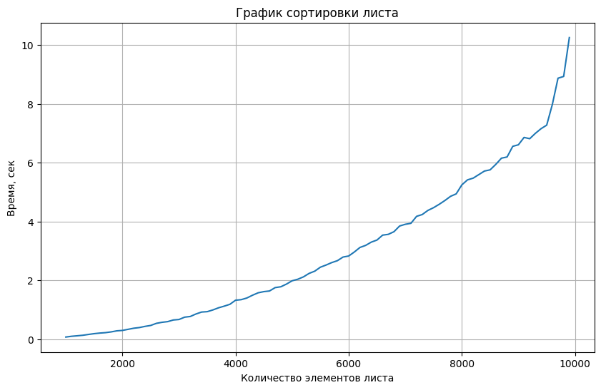
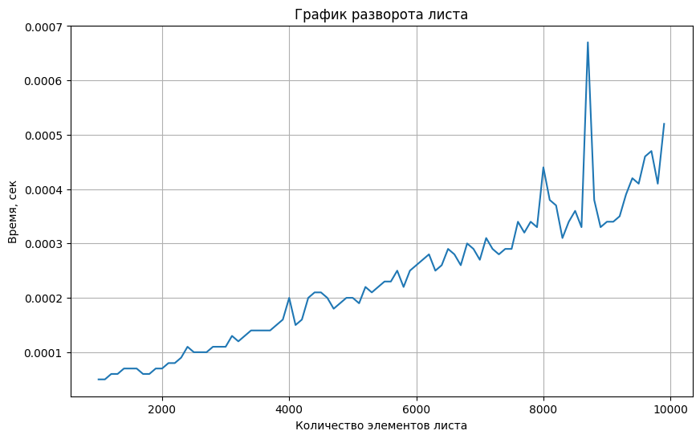
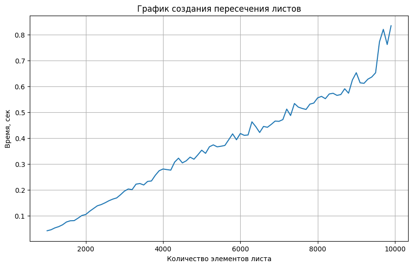

# Лабораторная работа 3
# Линейные списки (Linked list)
## Цель работы
изучение структуры данных «Линейные списки», а также основных операций над ними.
## Задачи лабораторной работы
1. Изучение вариантов линейных списков
2. Написание односвязного линейного списка
## Словесная постановка задачи
1. Изучить варианты линейных списков
2. Написать 6 версий линейного односвязного списка
3. Написать функцию, которая по двум данным линейным спискам формирует новый список, состоящий из элементов, одновременно входящих в оба данных списка.
## Реализация односвязного списка
Первая часть реализует класс Node, описывающий 1 элемент списка
``` Python
#1

class Node:
    def __init__(self, data):
        self.data = data
        self.next = None

    def __repr__(self):
        return f"Node({self.data})"
```
Вторая часть реализует последовательно 6 версий односвязного списка: стандартный, с добавлением указателя на хвост, с подсчетом элементов, с поддержкой итератора, с рекурсией, с втавкой в любое место (метод insert)
``` Python
#2 

class List1:
    def __init__(self):
        self.head = None

    def is_empty(self):
        return self.head is None

    def delete(self, data):
        if self.head is None:
            return
        if self.head.data == data:
            self.head = self.head.next
            return
        current = self.head
        while current.next and current.next.data != data:
            current = current.next
        if current.next:
            current.next = current.next.next

    def display(self):
        elements = []
        current = self.head
        while current:
            elements.append(str(current.data))
            current = current.next
        return ", ".join(elements) + ", None"

    def reverse(self):
        prev = None
        current = self.node
        while current:
            next_node = current.next
            current.next = prev
            prev = current
            current = next_node
        self.head = prev

    def sort(self):
        if self.head is None or self.head.next is None:
            return
        swapped = True
        while swapped:
            swapped = False
            current = self.head
            while current and current.next:
                if cureent.data > current.next.data:
                    current.data, current.next.data = current.next.data, current.data
                    swapped = True
                current = current.next

class List2(List1):
    def __init__(self):
        super().__init__()
        self.tail = None

    def append(self, data):
        new_node = Node(data)
        if self.head is None:
            self.head = new_node
            self.tail = new_node
        else:
            self.tail.next = new_node
            self.tail = new_node

    def prepend(self, data):
        new_node = Node(data)
        if self.head is None:
            self.head = new_node
            self.tail = new_node
        else:
            new_node.next = self.head
            self.head = new_node

class List3(List2):
    def __init__(self):
        super().__init__()
        self.length = 0

    def append(self, data):
        super().append(data)
        self.length += 1

    def prepend(self, data):
        super().prepend(data)
        self.length += 1

    def delete(self, data):
        if self.data is None:
            return
        if self.head.data == data:
            self.head = self.head.next
            self.length -= 1
            if self.head is None:
                self.tail = None
            return
        current = self.head
        while current.next and current.next.data != data:
            current = current.next
        if current.next:
            if current.next == self.tail:
                self.tail = current
            current.next = current.next.next
            self.length -= 1

class List4(List3):
    def __iter__(self):
        current = self.head
        while current:
            yield current.data
            current = current.next

    def __contains__(self, data):
        return any(item == data for item in self)

    def __len__(self):
        return self.length

class List5(List4):
    def display_recursive(self, node):
        if node is None:
            return "None"
        return f"{node.data} -> {self.display_recursive(node.next)}"

    def display(self):
        return self.display_recursive(self.head)

    def reverse_recursive(self, node):
        if node is None or node.next is None:
            return node

        new_head = self.reverse_recursive(node.next)
        node.next.next = node
        node.next = None
        return new_head

    def reverse(self):
        self.head = self.reverse_recursive(self.head)
        current = self.head
        while current and current.next:
            current = current.next
        self.tail = current

class List6(List5):
    def __get_item__(self, index):
        if index < 0 or index >= self.length:
            return Error("Index out of range")
        current = self.head
        for i in range(index):
            current = current.next
        return current.data
        
    def __set_item__(self, index, value):
        if index < 0 or index >= self.length:
            return Error("Index out of range")
        current = self.head
        for i in range(index):
            current = current.next
        curent.data = value
    def insert(self, index, data):
        if index < 0 or index >= self.length:
            return Error("Index out of range")
        if index == 0:
            self.prepend(data)
        elif inex == self.length:
            self.append(data)
        else:
            new_node = Node(data)
            current = self.data
            for i in range(index - 1):
                current = current.next
            new_node.next = current.next
            current.next = new_node
            self.length += 1
```
В третьей части происходит реализация индивидуального задания: метода peresechenie, создающего список из общих элементов двух данных списков
``` Python
# 3
def peresechenie(list1, list2):
    result = List6()
    current1 = list1.head
    
    while current1:
        current2 = list2.head
        found_in_list2 = False
        while current2:
            if current2.data == current1.data:
                found_in_list2 = True
                break
            current2 = current2.next
        if found_in_list2:
            result.current = result.head
            duplicate = False
            while result_current:
                if result_current.data == current1.data:
                    duplicate = True
                    break
                result_current = result_current.next
            if not duplicate:
                result.append(current1.data)
        current1 = current1.next

    return result   
```
В частях 4-10 демонстрируется работа всех основных методов на примерах
``` Python
# 4
print("List1")
list1 = List1()
list1.append(1)
list1.append(3)
list1.append(2)
print(list1.display())
list1.reverse()
print(list1.display())
list1.sort()
print(list1.display())

# 5
print("List2")
list2 = List2()
list2.append(2)
list2.append(3)
list2.prepend(1)
print(list2.display())

#6
print("List3")
list3 = List3()
list3.append(1)
list3.append(2)
list3.append(3)
print(list3.length)
list3.delete(2)
print(list3.length)

#7
print("List4")
list4 = List4()
list4.append('a')
list4.append('b')
list4.append('c')
for item in list4:
    print(item)
print(f"Содержит 'b': {'b' in list4}")
print(len(list4))
print()

#8
print("List5")
list5 = List5()
list5.append(1)
list5.append(2)
list5.append(3)
print(list5.display())
list5.reverse()
print(list5.display())

#9
print("List6")
list6 = List6()
list6.append(1)
list6.append(2)
list6.append(3)
list6.insert(1, 100)
print(list6.display())

#10
print("Peresechenie")
lista = List6()
listb = List6()

lista.append(1)
lista.append(2)
lista.append(3)

listb.append(1)
listb.append(2)
listb.append(4)

result = peresechenie(lista, listb)
print(result.display())
```
В одиннадцатой части происходит изображение трех основных методов (сортировка, разворот и пресечение) на графиках
``` Python
#11

import random
import functools
import timeit
import typing
import matplotlib.pyplot as plt

def get_usage_time(
    *, number: int = 1, setup: str = 'pass', ndigits: int = 3
) -> typing.Callable:
    def decorator(func: typing.Callable) -> typing.Callable:
        @functools.wraps(func)
        def wrapper(*args, **kwargs) -> float:
            usage_time = timeit.timeit(
                lambda: func(*args, **kwargs),
                setup=setup,
                number=number,
            )
            return round(usage_time / number, ndigits)

        return wrapper

    return decorator

def list_generator(n):
    list0 = List4()
    for i in range(n):
        list0.append(random.randint(1, 1000))
    return list0

def sort(list0):
    return list0.sort()

def reverse(list0):
    return list0.reverse()

times_sort = []
times_reverse = []
times_peresechenie = []

n = [i for i in range(1000, 10_000, 100)]
for m in n:
    list0 = list_generator(m)
    list1 = list_generator(m)
    
    time_sort = get_usage_time(ndigits=5)(sort)
    times_sort.append(time_sort(list0))

    time_reverse = get_usage_time(ndigits=5)(reverse)
    times_reverse.append(time_reverse(list0))

    time_peresechenie = get_usage_time(ndigits=5)(peresechenie)
    times_peresechenie.append(time_peresechenie(list0, list1))

plt.figure(figsize=(10, 6))
plt.plot(n, times_sort)
plt.title('График сортировки листа')
plt.xlabel('Количество элементов листа')
plt.ylabel('Время, сек')
plt.grid(True) 

plt.figure(figsize=(10, 6))
plt.plot(n, times_reverse)
plt.title('График разворота листа')
plt.xlabel('Количество элементов листа')
plt.ylabel('Время, сек')
plt.grid(True) 

plt.figure(figsize=(10, 6))
plt.plot(n, times_peresechenie)
plt.title('График создания пересечения листов')
plt.xlabel('Количество элементов листа')
plt.ylabel('Время, сек')
plt.grid(True) 
```
## Анализ графиков





Мы можем заметить, что сортировка пузырьком дает сложность O(n квадрат), переворот и пересечение рабтают O(n), то есть линейно
