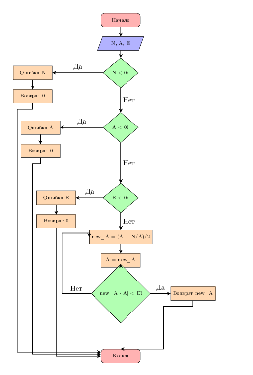

---
jupyter:
  jupytext:
    text_representation:
      extension: .md
      format_name: markdown
      format_version: '1.3'
      jupytext_version: 1.17.3
  kernelspec:
    display_name: Python 3 (ipykernel)
    language: python
    name: python3
---

# Итеративные и рекурсивные алгоритмы


## Цель работы


Изучить рекурсивные алгоритмы и рекурсивные структуры данных; научиться проводить анализ итеративных и рекурсивных процедур; исследовать эффективность итеративных и рекурсивных процедур при реализации на ПЭВМ.


### Задание 1(Рекурсивная реализация)


 Рекурсивное вычисление квадратного корня методом Ньютона
    
   Функция принимает три параметра:

 - N - число, из которого извлекаем корень

 - A - начальное приближение (guess)

 - E - точность вычисления (epsilon)

 Проверка входных данных

  - N < 0: Корень из отрицательного числа не определен в вещественных числах

  - N == 0: Корень из нуля всегда ноль

  - A ≤ 0: Начальное приближение должно быть положительным для корректной работы алгоритма
```python
import math
import time

def sqrt_recursive(N, A, E):
    if N < 0:
        raise ValueError("N должно быть неотрицательным")
    if N == 0:
        return 0.0
    if A <= 0:
        raise ValueError("A должно быть положительным")
    
    """Новое приближение по формуле Ньютона"""
    new_A = (A + N / A) / 2
    
    if abs(new_A - A) < E:
        return new_A
    
    return sqrt_recursive(N, new_A, E)

print("Введите число для извлечения квадратного корня:")
N = float(input())
print("Введите начальное приближение:")
A = float(input())
print("Введите точность вычисления:")
E = float(input())

try:
    result = sqrt_recursive(N, A, E)
    print(f"Квадратный корень из {N} с точностью {E}:")
    print(f"Результат: {result}")
    print(f"Проверка: {result} * {result} = {result * result}")
except ValueError as e:
    print(f"Ошибка: {e}")
```

### Задание 2 (Итеративная реализация (без рекурсии))

```python
def sqrt_iterative(N, A, E):
    if N < 0:
        raise ValueError("N должно быть неотрицательным")
    if N == 0:
        return 0.0
    if A <= 0:
        raise ValueError("A должно быть положительным")
    
    current_A = A
    while True:
        new_A = (current_A + N / current_A) / 2
        if abs(new_A - current_A) < E:
            return new_A
        current_A = new_A

print("Введите число для извлечения квадратного корня:")
N = float(input())
print("Введите начальное приближение:")
A = float(input())
print("Введите точность вычисления:")
E = float(input())

try:
    result = sqrt_iterative(N, A, E)
    print(f"Квадратный корень из {N} с точностью {E}:")
    print(f"Результат: {result}")
    print(f"Проверка: {result} * {result} = {result * result}")
except ValueError as e:
    print(f"Ошибка: {e}")
```

### Задание 3





## Работа декоратора(синтаксис)
@save_intermediate_results
###  Эквивалентно:
sqrt_recursive_decorated = save_intermediate_results(sqrt_recursive_decorated)

Без @wraps теряется информация об оригинальной функции


    Декоратор для автоматического сохранения промежуточных результатов рекурсии
    
    Принцип работы:
    1. Перехватывает каждый вызов функции
    2. Собирает статистику ДО выполнения функции
    3. Вызывает оригинальную функцию
    4. Собирает статистику ПОСЛЕ выполнения функции
  

```python
import sys
import time
from functools import wraps

class SqrtStats:
    """Контейнер для статистики выполнения алгоритмов"""
    def __init__(self):
        self.iterations = 0
        self.max_stack_depth = 0
        self.execution_time = 0
        self.intermediate_results = []
    
    def reset(self):
        """Сброс статистики перед новым запуском"""
        self.iterations = 0
        self.max_stack_depth = 0
        self.execution_time = 0
        self.intermediate_results = []

stats = SqrtStats() # Единый объект для всех алгоритмов

def save_intermediate_results(func):
    """Декоратор для автоматического сбора статистики рекурсии"""
    @wraps(func)
    def wrapper(N, A, E, depth=0):
        stats.iterations += 1
        stats.max_stack_depth = max(stats.max_stack_depth, depth)
        
        intermediate = {
            'depth': depth, 'N': N, 'A': A, 'E': E, 'timestamp': time.time()
        }
        
        result = func(N, A, E, depth)
        
        intermediate['result'] = result
        stats.intermediate_results.append(intermediate)
        
        return result
    return wrapper

def manual_sqrt_recursive_with_storage(N, A, E):
    """Рекурсивный алгоритм с ручным сбором статистики"""
    intermediate_results = []
    stack_depth = 0
    
    def recursive_helper(n, a, e, depth):
        nonlocal stack_depth
        stack_depth = max(stack_depth, depth)
        stats.iterations += 1
        
        # Сохраняем состояние до вычислений
        intermediate_results.append({
            'depth': depth, 'N': n, 'A': a, 'E': e, 'action': 'start'
        })
        
        if n < 0:
            raise ValueError("N должно быть неотрицательным")
        if n == 0:
            return 0.0
        if a <= 0:
            raise ValueError("A должно быть положительным")
        
        new_A = (a + n / a) / 2
        
        # Сохраняем результаты вычислений
        intermediate_results.append({
            'depth': depth, 'current_A': a, 'new_A': new_A, 
            'error': abs(new_A - a), 'action': 'calculated'
        })
        
        if abs(new_A - a) < e:
            intermediate_results.append({
                'depth': depth, 'result': new_A, 'action': 'completed'
            })
            return new_A
        
        result = recursive_helper(n, new_A, e, depth + 1)
        return result
    
    result = recursive_helper(N, A, E, 0)
    stats.max_stack_depth = stack_depth
    stats.intermediate_results = intermediate_results
    return result

@save_intermediate_results
def sqrt_recursive_decorated(N, A, E, depth=0):
    """Рекурсивный алгоритм с автоматическим сбором статистики через декоратор"""
    if N < 0:
        raise ValueError("N должно быть неотрицательным")
    if N == 0:
        return 0.0
    if A <= 0:
        raise ValueError("A должно быть положительным")
    
    new_A = (A + N / A) / 2
    
    if abs(new_A - A) < E:
        return new_A
    
    return sqrt_recursive_decorated(N, new_A, E, depth + 1)

def sqrt_iterative_with_stats(N, A, E):
    """Итеративный алгоритм со сбором статистики"""
    stats.reset()
    start_time = time.time()
    
    if N < 0:
        raise ValueError("N должно быть неотрицательным")
    if N == 0:
        stats.execution_time = time.time() - start_time
        return 0.0
    if A <= 0:
        raise ValueError("A должно быть положительным")
    
    current_A = A
    iteration = 0
    
    while True:
        iteration += 1
        stats.iterations = iteration
        
        new_A = (current_A + N / current_A) / 2
        
        stats.intermediate_results.append({
            'iteration': iteration, 'current_A': current_A, 
            'new_A': new_A, 'error': abs(new_A - current_A)
        })
        
        if abs(new_A - current_A) < E:
            break
            
        current_A = new_A
    
    stats.execution_time = time.time() - start_time
    return new_A

def analyze_sqrt_stack_limit():
    """Определение максимальной безопасной глубины рекурсии"""
    original_limit = sys.getrecursionlimit() # Получаем системный лимит (обычно 1000)
    max_safe_iterations = 0
    
    for i in range(original_limit - 100):
        try:
            sqrt_recursive_decorated(2, 1, 1e-300)
            max_safe_iterations = i
        except RecursionError:
            break
    
    return max_safe_iterations, original_limit

def sqrt_performance_comparison(test_cases):
    """Сравнение производительности всех алгоритмов"""
    results = []
    
    for N, A, E in test_cases:
        print(f"\nТестирование sqrt({N}) с A={A}, E={E}:")
        
        # Рекурсивный с декоратором
        stats.reset()
        start_time = time.time()
        try:
            result1 = sqrt_recursive_decorated(N, A, E)
            recursive_time = time.time() - start_time
            print(f"Рекурсивный (декоратор): {result1:.6f}")
            print(f"  Время: {recursive_time:.6f}с, Итерации: {stats.iterations}, Глубина: {stats.max_stack_depth}")
        except Exception as e:
            print(f"Рекурсивный (декоратор): Ошибка - {e}")
            recursive_time = float('inf')
        
        # Рекурсивный ручной
        stats.reset()
        start_time = time.time()
        try:
            result2 = manual_sqrt_recursive_with_storage(N, A, E)
            manual_time = time.time() - start_time
            print(f"Рекурсивный (ручной): {result2:.6f}")
            print(f"  Время: {manual_time:.6f}с, Итерации: {stats.iterations}, Глубина: {stats.max_stack_depth}")
        except Exception as e:
            print(f"Рекурсивный (ручной): Ошибка - {e}")
            manual_time = float('inf')
        
        # Итеративный
        stats.reset()
        try:
            result3 = sqrt_iterative_with_stats(N, A, E)
            iterative_time = stats.execution_time
            print(f"Итеративный: {result3:.6f}")
            print(f"  Время: {iterative_time:.6f}с, Итерации: {stats.iterations}")
        except Exception as e:
            print(f"Итеративный: Ошибка - {e}")
            iterative_time = float('inf')
        
        # Проверка совпадения результатов
        try:
            if abs(result1 - result2) < E and abs(result2 - result3) < E:
                print("  Все алгоритмы дали одинаковый результат")
            else:
                print("  Результаты различаются")
        except:
            print("  Невозможно сравнить результаты")
        
        results.append({
            'N': N, 'A': A, 'E': E,
            'recursive_time': recursive_time,
            'manual_time': manual_time,
            'iterative_time': iterative_time,
            'iterations': stats.iterations,
            'stack_depth': stats.max_stack_depth
        })
    
    return results

def print_intermediate_results():
    """Вывод промежуточных результатов"""
    print("\nПромежуточные результаты:")
    for i, result in enumerate(stats.intermediate_results[-5:]):
        print(f"  {i+1}: {result}")

if __name__ == "__main__":
    print("=" * 50)
    print("АНАЛИЗ АЛГОРИТМОВ ВЫЧИСЛЕНИЯ КВАДРАТНОГО КОРНЯ")
    print("=" * 50)
    
   
    print("\n1. АНАЛИЗ ОГРАНИЧЕНИЙ РЕКУРСИИ")
    max_iterations, limit = analyze_sqrt_stack_limit()
    print(f"Лимит рекурсии: {limit}")
    print(f"Безопасное количество итераций: {max_iterations}")
    
  # Тестовые данные
    test_cases = [
        (25, 5, 1e-10),
        (2, 1, 1e-10),
        (100, 10, 1e-12),
        (1000, 30, 1e-8),
        (0.25, 0.5, 1e-10),
    ]
    
    print("\n2. СРАВНЕНИЕ ПРОИЗВОДИТЕЛЬНОСТИ")
    results = sqrt_performance_comparison(test_cases)
    
    
    print("\n3. СВОДНАЯ СТАТИСТИКА")
    print("Алгоритм           | Время     | Итерации | Глубина")
    print("-" * 50)
    
    successful = [r for r in results if r['recursive_time'] != float('inf')]
    
    if successful:
        recursive_times = [r['recursive_time'] for r in successful]
        manual_times = [r['manual_time'] for r in successful]
        iterative_times = [r['iterative_time'] for r in successful]
        
        print(f"Рекурсивный (декор) | {sum(recursive_times)/len(recursive_times):.6f}с | "
              f"{max(r['iterations'] for r in successful):<8} | {max(r['stack_depth'] for r in successful)}")
        
        print(f"Рекурсивный (ручной) | {sum(manual_times)/len(manual_times):.6f}с | "
              f"{max(r['iterations'] for r in successful):<8} | {max(r['stack_depth'] for r in successful)}")
        
        print(f"Итеративный         | {sum(iterative_times)/len(iterative_times):.6f}с | "
              f"{max(r['iterations'] for r in successful):<8} | -")
    
    
    print("\n4. ДЕМОНСТРАЦИЯ ")
    stats.reset()
    try:
        sqrt_recursive_decorated(25, 5, 1e-10)
        print_intermediate_results()
    except Exception as e:
        print(f"Ошибка: {e}")
    
    print("\n" + "=" * 50)
```

# Контрольные вопросы 
## Итеративный алгоритм
— это алгоритм, который выполняет набор инструкций (тело цикла) многократно, пока не будет выполнено некоторое условие. Он использует циклы (for, while) для повторения действий.

Пример (вычисление факториала):

python

def factorial_iterative(n):

    result = 1
    
    for i in range(1, n + 1):
    
        result *= i
        
    return result
 ## Рекурсивный алгоритм
 — это алгоритм, который вызывает сам себя в своем определении для решения более мелкой версии той же задачи. Обязательно должен быть базовый случай (условие выхода), который прекращает рекурсию.

Пример (вычисление факториала):

python
def factorial_recursive(n):

    if n == 0 or n == 1:  # Базовый случай
    
        return 1
        
    else:                  # Рекурсивный случай
    
        return n * factorial_recursive(n - 1)
## 2. Элементы рекурсивной функции
Два обязательных элемента:

### Базовый случай (Base Case):
Простейший случай, который решается напрямую без рекурсивных вызовов. Его назначение — остановить рекурсию и предотвратить бесконечные вызовы (и переполнение стека).

### Рекурсивный случай (Recursive Case):
Часть функции, в которой происходит вызов самой себя с измененными (обычно упрощенными) аргументами, приближающими решение к базовому случаю.

 ## 3. Глубина рекурсии и переполнение стека
Глубина рекурсии — это максимальное количество вложенных рекурсивных вызовов функции. Она ограничена размером стека вызовов (call stack).

Переполнение стека (Stack Overflow) возникает, когда **глубина рекурсии превышает максимально допустимый размер стека вызовов.** Стек вызовов — это специальная область памяти, где хранится информация о каждом вызове функции (аргументы, локальные переменные, адрес возврата). При слишком глубокой рекурсии эта память исчерпывается.

### Условия возникновения:

Отсутствие или неправильное условие базового случая.

Слишком большая глубина рекурсии для имеющегося размера стека.

## 4. Сравнительная таблица: Итерация vs Рекурсия
| Критерий | Итеративный подход | Рекурсивный подход |
|----------|-------------------|-------------------|
| **Читаемость кода** | Может быть менее интуитивным для рекурсивно определяемых задач (деревья, фракталы) | Часто более лаконичный и понятный, если задача имеет естественную рекурсивную структуру |
| **Использование памяти** | Экономит память, так как не использует стек вызовов для хранения промежуточных состояний | Использует больше памяти из-за стека вызовов. Каждый вызов сохраняет свое состояние в стеке |
| **Скорость выполнения** | Обычно быстрее, так как нет накладных расходов на вызовы функций и управление стеком | Обычно медленнее из-за накладных расходов на вызовы функций и работу со стеком |

## Почему рекурсия использует больше памяти?

Каждый рекурсивный вызов помещает в стек вызовов новый **стековый фрейм**, содержащий:
- Аргументы функции
- Локальные переменные  
- Адрес возврата

Пока функция не завершится, этот фрейм остается в стеке. При большой глубине рекурсии эти фреймы накапливаются и потребляют значительный объем памяти.

 ## 5. Предпочтительные области применения
Рекурсия предпочтительнее для:

Задач, рекурсивных по определению: Обход деревьев и графов (DFS), синтаксический разбор, задачи с "разделяй и властвуй" (сортировка слиянием, быстрая сортировка), Ханойские башни.

Обоснование: Код становится гораздо проще для написания и понимания, так как он напрямую отражает рекурсивную природу задачи.

Итерация предпочтительнее для:

Простых линейных обработок: Вычисление суммы/произведения элементов, поиск в массиве.

Задач с ограниченной памятью: Когда важна эффективность использования памяти.

Обоснование: Меньшие накладные расходы, полный контроль над процессом, нет риска переполнения стека.

 ## 6. Хвостовая рекурсия и преобразование
 ### Хвостовая рекурсия
 — это частный случай рекурсии, при котором рекурсивный вызов является последней операцией в функции перед возвратом результата.

### Почему она важна? 
Некоторые компиляторы/интерпретаторы (например, в функциональных языках) могут выполнять оптимизацию хвостовой рекурсии (TCO). TCO преобразует хвостовую рекурсию в итеративный цикл "под капотом", что позволяет избежать роста стека вызовов и делает рекурсию столь же эффективной, как и итерация.

Пример НЕ хвостовой рекурсии (факториал):
return n * factorial(n-1) // Умножение происходит ПОСЛЕ рекурсивного вызова.

Пример хвостовой рекурсии (факториал с аккумулятором):

python

def factorial_tail(n, accumulator=1):

    if n == 0:
    
        return accumulator
        
    else:
    
        # Умножение происходит ДО вызова, вызов - последняя операция.
        
        return factorial_tail(n - 1, n * accumulator)
        
### Общий алгоритм преобразования рекурсии в итерацию:

 - Создайте цикл (например, while True).

 - Замените рекурсивные случаи на обновление параметров функции (которые становятся переменными цикла).

 - Базовый случай становится условием выхода из цикла (break или return).

 - Для эмуляции стека (если рекурсия не хвостовая) используйте явную структуру данных — стек.

### Структура данных для эмуляции рекурсии:
Чаще всего используют стек (LIFO). В него помещаются задачи, которые нужно обработать.

Пример (обход дерева в глубину):

python
### Рекурсивный DFS (неявный стек)
def dfs_recursive(node):
    if node is None:
        return
    print(node.value)
    dfs_recursive(node.left)
    dfs_recursive(node.right)

###  Итеративный DFS (явный стек)
def dfs_iterative(root):
    stack = [root]
    while stack:
        node = stack.pop()
        if node is not None:
            print(node.value)
            # Сначала кладем правого, потом левого, чтобы левый обработался первым.
            stack.append(node.right)
            stack.append(node.left)
            
### Можно ли преобразовать любую рекурсивную функцию?
Да, любую рекурсивную функцию можно преобразовать в итеративную, и наоборот. Теоретически, они эквивалентны по выразительной мощности. На практике преобразование сложной рекурсии (например, с несколькими рекурсивными вызовами) может быть нетривиальным и требовать явного управления стеком.

## 7. Преобразования и примеры функций
Преобразование итеративного цикла в рекурсию (сумма чисел от 1 до n):

python
### Итеративная
def sum_iterative(n):
    total = 0
    for i in range(1, n + 1):
        total += i
    return total

### Рекурсивная
def sum_recursive(n):
    if n == 1:  # Базовый случай
        return 1
    else:       # Рекурсивный случай
        return n + sum_recursive(n - 1)
Преобразование рекурсивной функции в итерацию (печать чисел от n до 1):

python
### Рекурсивная
def print_recursive(n):
    if n >= 1:
        print(n)
        print_recursive(n - 1)

### Итеративная
def print_iterative(n):
    for i in range(n, 0, -1):
        print(i)
Числа Фибоначчи:

python
### Итеративная (эффективная)
def fib_iterative(n):
    a, b = 0, 1
    for _ in range(n):
        a, b = b, a + b
    return a

### Рекурсивная (неэффективная)
def fib_recursive(n):
    if n <= 1:
        return n
    else:
        return fib_recursive(n - 1) + fib_recursive(n - 2)
        
### Проблема наивного рекурсивного Фибоначчи:
Она имеет экспоненциальную временную сложность O(2^n). Это происходит потому, что функция многократно вычисляет одни и те же значения (например, fib(3) вычисляется много раз при вычислении fib(5)).

Решение:

Мемоизация: Кеширование уже вычисленных результатов.

python
from functools import lru_cache

@lru_cache(maxsize=None)
def fib_memo(n):
    if n <= 1:
        return n
    else:
        return fib_memo(n - 1) + fib_memo(n - 2)
Итеративный подход (см. выше): Имеет линейную сложность O(n) и константную память O(1).

Динамическое программирование: Аналогично итеративному, с сохранением всех значений в массиве.

## 8. Другие алгоритмы и трассировка
Рекурсивный факториал (преобразование):

python
### Рекурсивная
def factorial_recursive(n):
    if n == 0:
        return 1
    return n * factorial_recursive(n - 1)

### Итеративная
def factorial_iterative(n):
    result = 1
    for i in range(1, n + 1):
        result *= i
    return result
## Рекурсивный бинарный поиск:

python
def binary_search(arr, low, high, target):
    if low > high: # Базовый случай: элемент не найден
        return -1

    mid = (low + high) // 2

    if arr[mid] == target: # Базовый случай: элемент найден
        return mid
    elif arr[mid] > target:
        return binary_search(arr, low, mid - 1, target) # Рекурсивный вызов для левой части
    else:
        return binary_search(arr, mid + 1, high, target) # Рекурсивный вызов для правой части
## Алгоритм Евклида (НОД):

python
def gcd(a, b):
    if b == 0: # Базовый случай
        return a
    else:      # Рекурсивный случай
        return gcd(b, a % b)
Трассировка f(3) для f(n) = f(n-1) + f(n-2), где f(0)=0, f(1)=1:
Дерево вызовов:

text
        f(3)
        /   \
    f(2)     f(1)
    /   \       \
 f(1)   f(0)     1
 /        \
1          0
Состояние стека (упрощенно):

Вызов f(3). Стек: [f(3)]

f(3) вызывает f(2). Стек: [f(3), f(2)]

f(2) вызывает f(1). Стек: [f(3), f(2), f(1)]

f(1) возвращает 1. Стек: [f(3), f(2)]

f(2) вызывает f(0). Стек: [f(3), f(2), f(0)]

f(0) возвращает 0. Стек: [f(3), f(2)]

f(2) возвращает 1 + 0 = 1. Стек: [f(3)]

f(3) вызывает f(1). Стек: [f(3), f(1)]

f(1) возвращает 1. Стек: [f(3)]

f(3) возвращает 1 + 1 = 2. Стек: []

Количество вызовов для f(4): Всего 9 вызовов. Можно посчитать по дереву.

## 9. Продвинутые концепции
Прямая vs Косвенная рекурсия:

Прямая: Функция A вызывает саму себя.

Косвенная: Функция A вызывает функцию B, которая в свою очередь вызывает функцию A.

python
def is_even(n):
    if n == 0:
        return True
    else:
        return is_odd(n - 1)

def is_odd(n):
    if n == 0:
        return False
    else:
        return is_even(n - 1)

### Мемоизация
— это техника кеширования результатов выполнения функции для предотвращения повторных вычислений с одними и теми же аргументами. Она кардинально улучшает производительность рекурсивных алгоритмов с перекрывающимися подзадачами (как числа Фибоначчи). Пример был приведен выше с @lru_cache.

Почему обход дерева часто рекурсивный?
Структура дерева рекурсивна по своей природе: у каждого узла есть поддеревья. Рекурсивный код (visit(node); visit(node.left); visit(node.right)) интуитивно понятен и лаконичен. Итеративная реализация DFS требует явного стека, а BFS — очереди, что делает код немного более сложным.

Всегда ли рекурсия читаемее? Нет.
Для простых циклических действий итерация часто понятнее.

Пример (сумма массива):

python
### Итерация (очень понятно)
total = 0
for num in arr:
    total += num

### Рекурсия (избыточно)
def sum_arr(arr, index=0):
    if index == len(arr):
        return 0
    return arr[index] + sum_arr(arr, index + 1)
    
## Оптимизация хвостовой рекурсии (TCO)
— это техника, при которой компилятор заменяет рекурсивный вызов в хвостовой позиции на переход (jump) к началу функции. Это переиспользует текущий стековый фрейм вместо создания нового, предотвращая рост стека. Это критически важно для функциональных языков, где рекурсия — основной способ организации циклов. В Python TCO не реализована.

## Неявный стек
— это стек вызовов, которым управляет среда выполнения (интерпретатор/компилятор). В итеративных алгоритмах обхода деревьев мы используем явный стек (обычно список Python), которым управляем вручную, чтобы имитировать работу неявного стека при рекурсии.


```python

```
